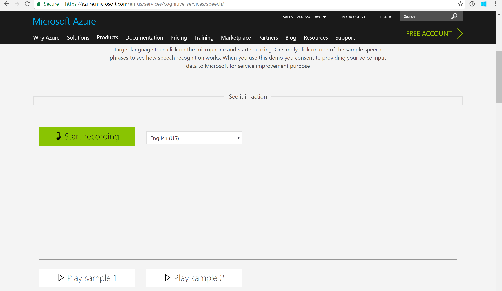
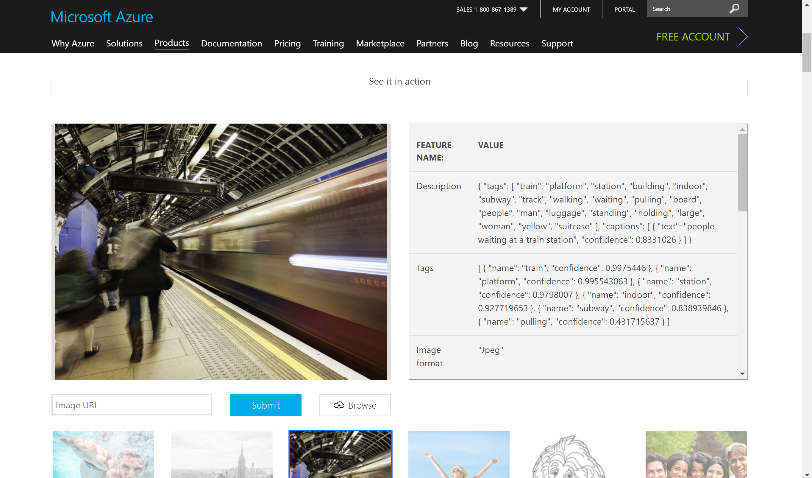
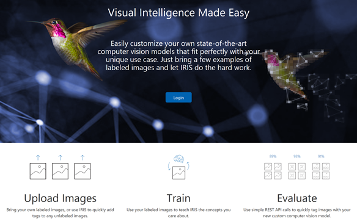
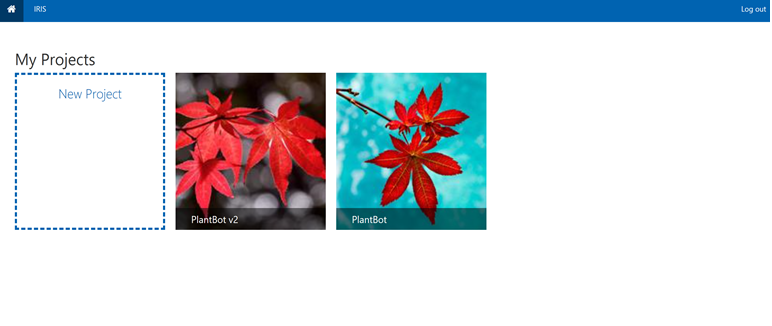
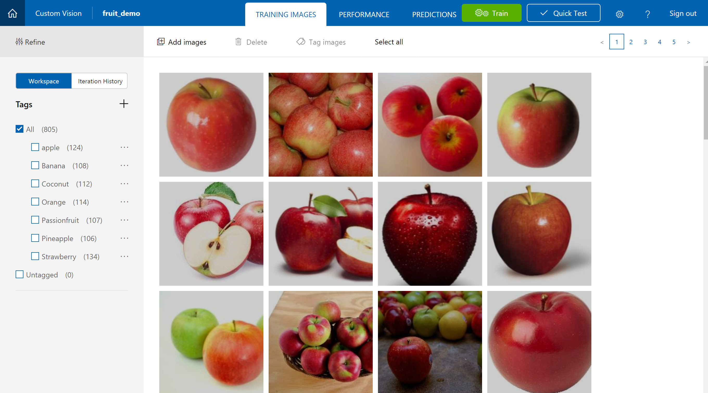
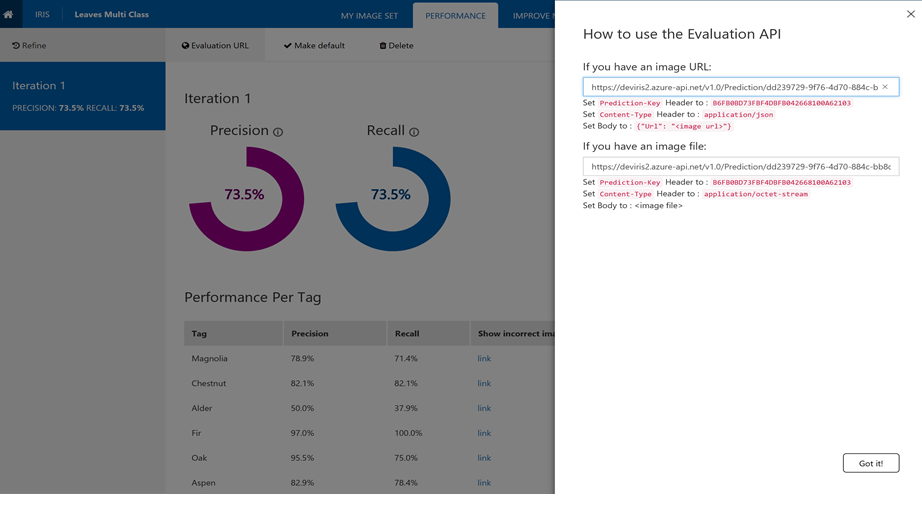
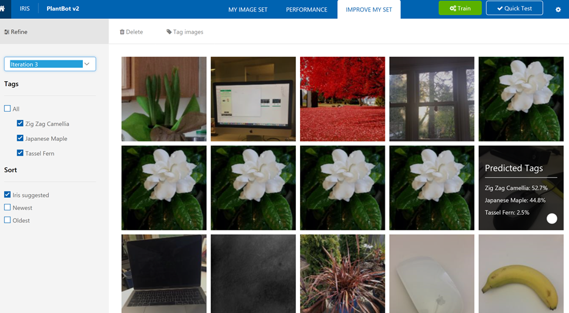
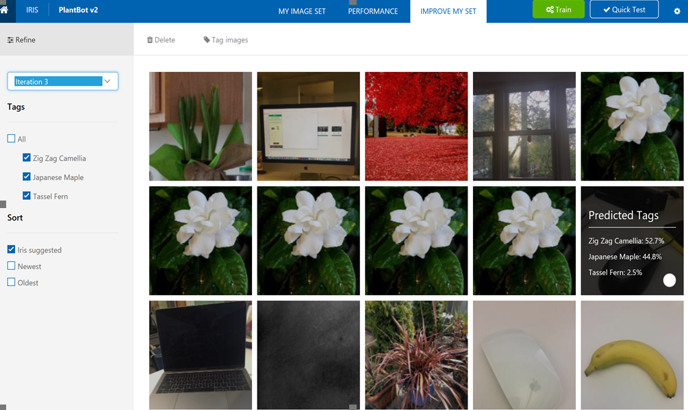

Last updated: 2/7/2018

Value Props
===========

The **three things viewers** should take away from this demo:

1.  **"AI" based cloud services for common tasks**

    -   Cognitive Services are easy to use pre-built and customizable
        services for common tasks where you want to use "AI" (speech,
        NLP, vision, etc)

2.  **Easy to use in your application**

    -   Cognitive Services are easy to use and compose in your
        applications

3.  **Customization with CustomVision.ai**

    -   Custom Vision Service lets you build a custom image classifier
        with ease

Demo Machines (requirements) and Tools
======================================

-   MacOS or Surface Book

-   Wired internet connection

-   Microphone (for Bing speech)

Demo Pre-Setup and Cleanup
==========================

-   Unzip folder "fruits.zip" in Documents or Desktop:

-   Open these tabs

    -   Microsoft.com/cognitive

    -   <https://azure.microsoft.com/en-us/services/cognitive-services/speech/>

    -   <https://azure.microsoft.com/en-us/services/cognitive-services/computer-vision/>

    -   <http://customvision.ai>

Microsoft Cognitive Services are a set of cloud services available on
Azure in the areas of machine intelligence. These APIs make it simple to
add "AI" based capabilities to your application. We've taken common
needs like speech to text or finding a face in an image and made it as
simple as calling a REST API.

There are 30 services across Vision, Language, Speech, Knowledge, and
Search.

Let's look at some examples.

-   Go to <http://microsoft.com/cognitive>

-   Select speech

-   Click on "Start recording". Say something, click on "Stop
    recording."

> 

**Explanation**- Here I am on the Cognitive Services site- you can try
these demos out yourself at home.

Bing Speech API gives you text to speech, or speech to text. So, I can
send something like "I am having a lovely time in NYC" to the API via
this web demo and get a transcription.

If I had custom vocabulary or sound environment, I could even use the
Custom Speech Service to build my own customized speech to text system,
enhanced for my own domain.

Or I can use the Text Analytics API to get the language, sentiment, and
key phrases in a sentence.

All these APIs are designed to give you more information or context
about a piece of content, as easily as possible.

-   Go to vision tab and Upload a picture

    

**Explanation-** The Computer Vision API gives you tags, so that you
know what is in an image. For example, "train", "station", "subway". It
can also generate an image caption- we're using that today to make
Office and Windows more accessible.

However, in some cases, you want to recognize things that the APIs don't
recognize. For that, we built Custom Vision Service.

One of the top requests from businesses and customers since then has
been to allow them to customize the APIs to recognize their own
products. To this end, we released our Custom Vision Service last May to
enable companies to add computer vision to their applications, without a
background in the field.

> 

**Explanation-** Custom Vision Service is a tool for developers to quickly and easily
build and deploy their own image classifiers.

The workflow is simple: upload some training data, train, then call your
model via a REST endpoint.

Go to- <http://customvision.ai> to learn more

This is my projects page. Let's look at a project I was working on
earlier.

> 

**Explanation-** I've already uploaded a couple of training images.

Right now, you are looking at the UX, but this website is built on
public APIs- you can do anything you see today programmatically or via
this UX.

This classifier already recognizes a couple of fruit, but I want to add
one more. I am going to upload these images- as you'll see, upload is
the longest thing we end up having to do!

Custom Vision Service is based on transfer learning, we only needed a
handful of images per class.

This also means that training time is very fast- on the order of seconds
or minutes. The whole process of building a classifier, from uploading
data to training, can be done in less than ten minutes

-   Open project

-   Click "add images"

-   Upload folder of images

    

**Explanation-** Trained models are hosted at a REST endpoint, which users can call from
their website or application.

I can do a quick test of my model here.

-   Click on performance tab

-   Click on Prediction URL

-   Click on Quick Test. Upload a local image to Quick Test. Scroll down
    to see results.

    

    All the images sent to my classifier are saved here and ranked in
    order of which images we think you should label. So, you can improve
    your classifier over time. I can label these images to make my
    classifier better in minutes

<!-- -->

-   Click Predictions

    

    **Explanation-** We host your model at an API endpoint, but Sometimes you need an
    on-client experience because of network issues or latency. MSFT is
    here for you at the intelligent edge.

    Custom Vision Service also allows you to download models to run them
    locally on a device. This is particularly useful for offline
    scenarios or the edge. Here I can choose to export my model to
    Apple's new CoreML format and download it.

    This is super easy to add to your own applications to run your model
    locally.

    In a few weeks, you'll be able to do the same with Android.

-   Performance

-   Export

-   iOS/CoreML

-   Export

-   Download

    
[ ]{.underline}
